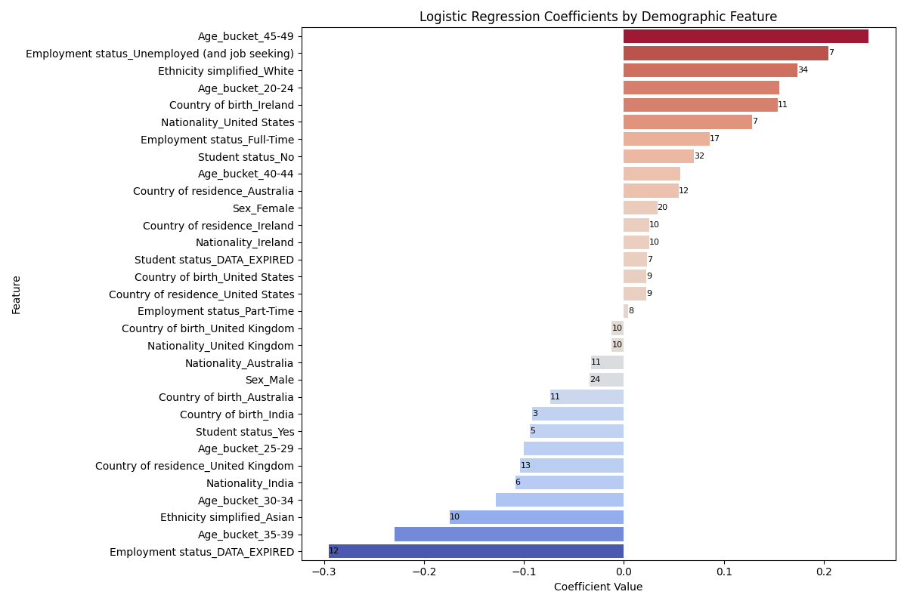
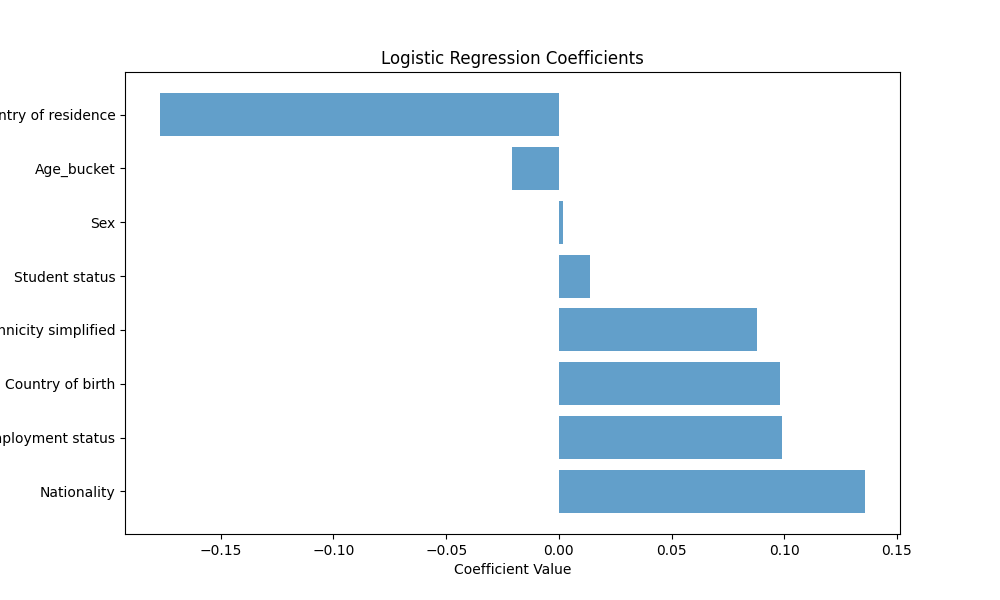

# Research Context and Overview

This folder contains the outputs of a research project analyzing demographic influences on annotator agreement with majority labels in the **EPICorpus dataset**. By leveraging logistic regression, we have explored how different demographic factors—such as age, sex, ethnicity, and nationality—affect annotator behavior.

---

## **Demographic Plots**

### 1. **Logistic Regression Coefficients**



This plot shows the logistic regression coefficients for various demographic features:

- **Positive coefficients**: Indicate that annotators from the demographic group are more likely to agree with the majority label.
- **Negative coefficients**: Indicate that annotators from the demographic group are less likely to agree with the majority label.

**Key Observations:**
- Certain age groups and nationalities exhibit higher levels of agreement with majority labels.
- The coefficients also reveal potential biases in annotation practices influenced by demographic backgrounds.

---

### 2. **EPICorpus Logistic Regression Coefficients**



This plot specifically analyzes demographic factors within the EPICorpus dataset:

- **Age Buckets**: Binned into 5-year intervals to explore age-related trends.
- **Sex and Ethnicity**: Investigated for their roles in annotator agreement.
- **Geographical Factors**: Country of birth, residence, and nationality provide insights into potential regional biases.

**Insights:**
- Regional and ethnic diversity play a significant role in annotation agreement.
- Certain subgroups, particularly those with fewer annotators, exhibit higher variability in agreement rates.

---

## **Research Objectives**

The primary goals of this research were to:

1. **Identify demographic factors influencing annotation agreement**:
   - Assess how different demographic subgroups align with majority labels.
   - Highlight potential sources of annotation bias.

2. **Mitigate the impact of small sample sizes**:
   - Groups with fewer than 5 annotators were excluded to ensure statistical reliability.

3. **Detect and analyze anomalies**:
   - Flagged instances where annotators significantly deviated from consensus to identify potential outliers.

---

## **Folder Structure**

```plaintext
.
├── csv
│   └── EPICorpus.csv          # The primary dataset analyzed
├── plots
│   ├── logistic_regression_coefficients.png          # General demographic analysis
│   └── logistic_regression_coefficients_epicorpus.png  # Specific analysis for EPICorpus
├── analysis.py                # Main script for demographic logistic regression
├── analysis_all.py            # Extended analysis for all demographic features
├── detection.py               # Anomaly detection methods
└── README.md                  # Project description (this file)
